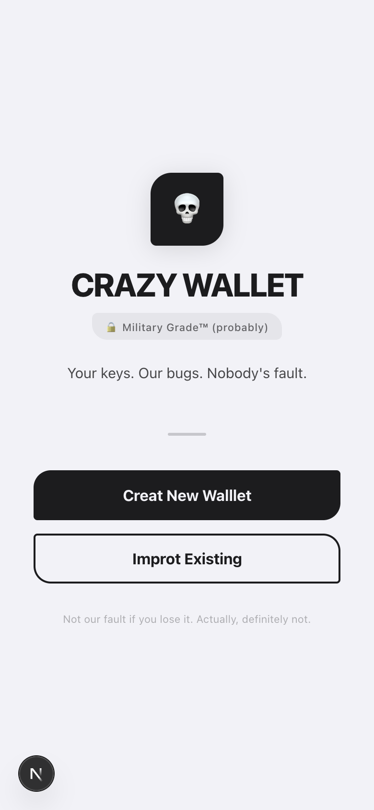
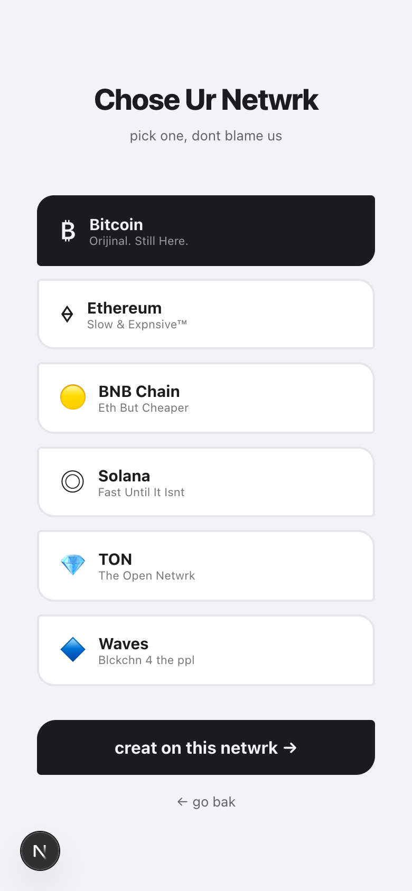
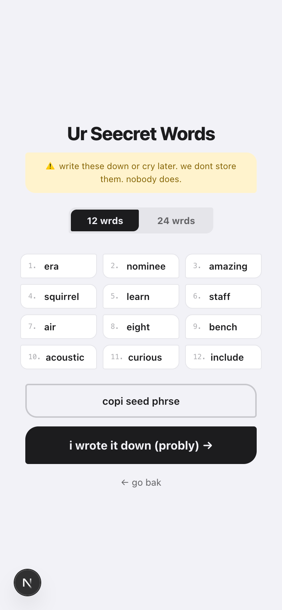
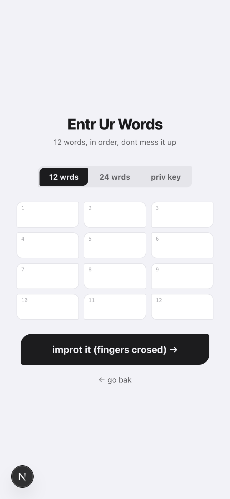
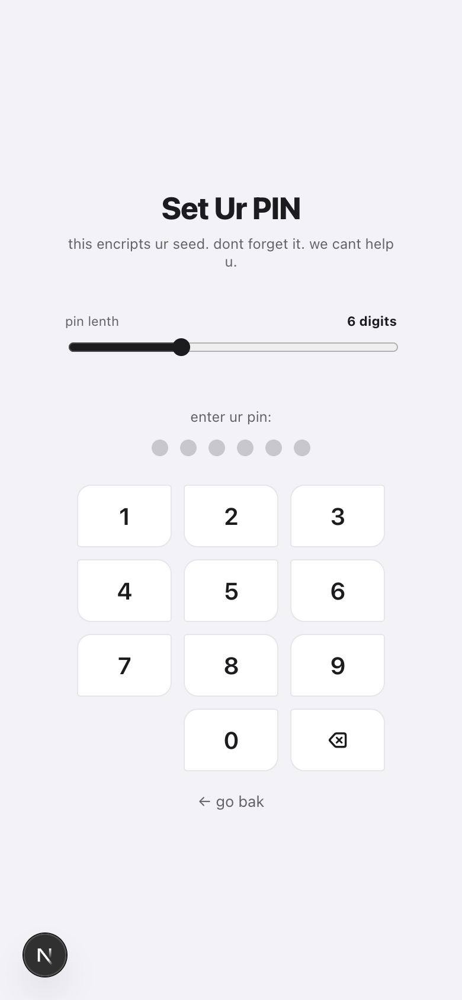
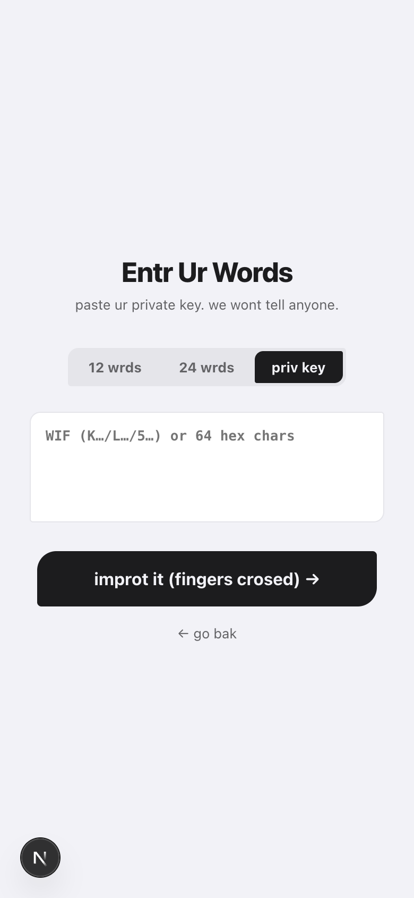
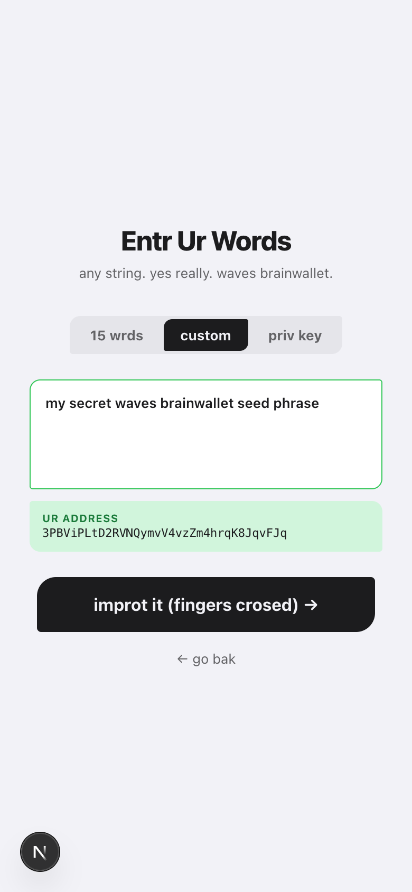

# 💀 CRAZY CRYPTO WALLET

> *"not your keys, not your coins. also not our problem."*

A self-custody crypto wallet that actually looks good and handles your keys locally. No servers, no tracking, no trust required. Just you, your seed phrase, and our probably-fine AES-256 encryption.

Built on the **PIE framework** — a Python + Next.js full-stack setup with opinionated mobile-first UI components.

---

## 📸 Screenshots

<div align="center">

| Home | Pick a Network | Generate Seed |
|:---:|:---:|:---:|
|  |  |  |

| Import Wallet | Set Your PIN | BTC Private Key |
|:---:|:---:|:---:|
|  |  |  |

| WAVES Brainwallet |
|:---:|
|  |

</div>

---

## ⛓️ Supported Networks

| Network | Currency | Import Formats |
|---------|----------|----------------|
| ₿ Bitcoin | BTC | 12/24-word seed, WIF private key, hex private key |
| ⟠ Ethereum | ETH | 12/24-word seed, hex private key |
| 🟡 BNB Chain | BNB | 12/24-word seed, hex private key |
| ◎ Solana | SOL | 12/24-word seed, hex private key |
| 💎 TON | TON | 12/24-word seed (TON-specific), hex private key |
| 🔷 Waves | WAVES | 15-word seed, brainwallet (any string), hex/base58 private key |

---

## 🚀 Install & Run

### Prerequisites

- [Bun](https://bun.sh) (recommended) or Node.js 18+
- Python 3.11+ with `pip` (for the API backend)

### Frontend (Next.js)

```bash
git clone https://github.com/J4h5u5/crazy-crypto-wallet.git
cd crazy-crypto-wallet

bun install
bun run dev
# → http://localhost:3000
```

### Backend API (Python / PIE)

The frontend needs the PIE API to serve wallet components:

```bash
cd api
pip install -e .
pie dev
# → http://localhost:8008
```

Or just run both:

```bash
# Terminal 1
bun run dev

# Terminal 2
cd api && pie dev
```

---

## 🔑 API Keys (Optional but Recommended)

By default, the wallet uses public RPC endpoints. They work, but they rate-limit you faster than you can say "insufficient funds."

### TON — get a free key, go fast

Get a free Toncenter API key from [@tonapibot](https://t.me/tonapibot) on Telegram. It bumps you from 1 req/s to 10 req/s — not much, but hey, it's free.

```bash
# .env.local
NEXT_PUBLIC_TON_API_KEY=your_key_here
```

### Other Networks

| Network | Default RPC | Better Alternatives |
|---------|------------|---------------------|
| ETH | Cloudflare (`cloudflare-eth.com`) | [Alchemy](https://alchemy.com), [Infura](https://infura.io), [QuickNode](https://quicknode.com) |
| BSC | `bsc-dataseed.binance.org` | [NodeReal](https://nodereal.io), [Ankr](https://ankr.com) |
| SOL | `api.mainnet-beta.solana.com` | [Helius](https://helius.dev), [Triton](https://triton.one) |
| BTC | `mempool.space/api` | Self-host [mempool](https://github.com/mempool/mempool) |
| WAVES | `nodes.wavesnodes.com` | Good enough tbh |
| TON | `toncenter.com/api/v2` | [@tonapibot](https://t.me/tonapibot) for free key |

Private RPCs from Alchemy/Infura are free tier friendly and significantly more reliable. Worth it for production use.

---

## 🔐 Security Model

- **Your keys never leave your device.** Derivation, signing, broadcasting — all client-side.
- **Seeds encrypted at rest** with AES-256-GCM + PBKDF2 (600,000 iterations, SHA-256). Your PIN is the only thing standing between your funds and someone with your phone. Make it good.
- **No analytics, no tracking, no backend calls for wallet ops.** The Python API only serves UI components — it has zero contact with your keys.
- **secp256k1 range validation** for BTC/ETH/BSC private keys. Because `0x0000...0001` is technically valid but you'd be the unluckiest person alive.

---

## 🔷 WAVES Special Features

WAVES is... a special network. Unlike every other chain on earth, it supports **brainwallet seeds** — literally any UTF-8 string becomes a valid wallet seed. Your pet's name? Valid. The full text of Moby Dick? Also valid (but maybe don't).

- **15-word seeds**: BIP39 wordlist, but 15 words instead of 12/24 because WAVES doesn't follow rules
- **Custom brainwallet**: any string, any language, any length — address preview shown live
- **Key derivation**: uses the official `@waves/ts-lib-crypto` (not standard Ed25519 — WAVES uses a modified curve25519 with clamp, so standard libraries give wrong addresses)

---

## 🛠️ Tech Stack

| Layer | Tech |
|-------|------|
| Framework | [PIE](https://github.com/swarm-ing/pie) — Python + Next.js |
| Frontend | Next.js (App Router), TypeScript, Tailwind |
| Crypto | `@scure/bip39`, `@scure/bip32`, `@scure/btc-signer`, `viem`, `@solana/web3.js`, `@ton/ton`, `@waves/ts-lib-crypto` |
| Encryption | Web Crypto API (AES-256-GCM + PBKDF2) |
| Backend | Python, FastAPI, PIE framework |

---

## 📁 Project Structure

```
crazy-crypto-wallet/
├── app/                    # Next.js pages (App Router)
│   └── wallet/
│       ├── create/         # New wallet flow
│       ├── import/         # Import wallet flow
│       └── pin/            # PIN creation/entry
├── lib/wallet/
│   ├── crypto.ts           # Key derivation, encryption, address generation
│   └── send.ts             # Balance fetching + transaction broadcasting
├── piecomponents/          # PIE UI components (TypeScript)
│   ├── SeedInputCard/      # Seed phrase / private key / brainwallet input
│   └── ...
└── api/                    # PIE Python backend
    └── pages/components/   # Component data providers
```

---

## ⚠️ Disclaimer

This is an **experimental project**. It has not been audited. Do not use it to store life savings. The skull logo is not a joke — crypto is dangerous and so is self-custody if you don't know what you're doing.

That said: the crypto libraries used (`@scure/*`, `viem`, `@ton/ton`, `@waves/ts-lib-crypto`) are well-audited production libraries. We're standing on the shoulders of giants. Slightly unhinged giants, but still.

---

*Made with ☕ and existential dread.*
